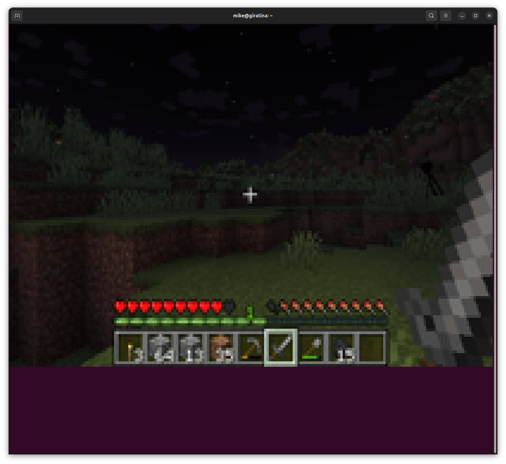
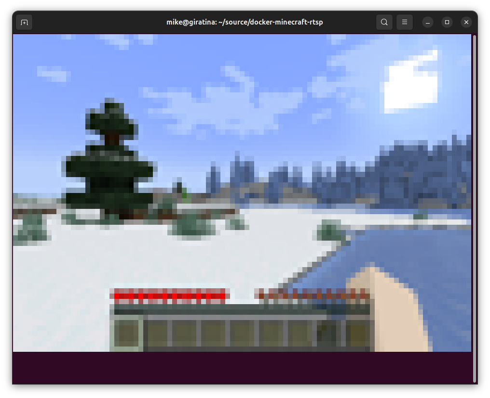

# Minecraft (Java Edition) Terminal Edition
###### No perfomance. No mercy. Just ANSI.

## What is this?
Ever wanted to play Minecraft in your terminal, streamed as glorious unicode characters, with all the performance and color accuracy of a 1990s dot matrix printer? No? Well, too bad. This project runs a full Minecraft server and client in Docker, and streams the game to your terminal either directly or over SSH. It’s as dumb as it sounds, and somehow, it works.

---

## Requirements
- **Docker** (if you don’t have this, it's not too late to turn around)
- **A real terminal**: You need full RGB color support. That means:
  - GNOME Terminal (Linux)
  - iTerm2 (Mac) - *the default Mac terminal does NOT work*
  - Windows Terminal
  - Kitty, Alacritty, or any other GPU-accelerated terminal
- **SSH client** (for multiplayer)
- **A sense of humor**

---

## Quickstart
### Singleplayer ("I have no friends mode")
```bash
./singleplayer_launch.sh
```
This builds and runs the client container interactively. You’ll be dropped straight into Minecraft in your terminal, connected to a local server, and forced to reflect on your life choices.

### Multiplayer ("I have at least one friend mode")
```bash
./multiplayer_launch.sh
```
This launches both the minecraft server and the rust rendering client in ssh server mode.


#### Connecting as a client (SSH method)
- Connect with your SSH client to port 9867:
  ```bash
  ssh -p 9867 localhost
  ```
- **Passwords are NOT accepted.** You must use a public key.
- Your public key’s fingerprint is used as your in-game username. This means your inventory and stats are persistent.

---

## Data Persistence
Both the server and client are run inside Docker. Volumes are set up in the launch scripts and `docker-compose.yml` to persist your world, configs, etc.

---

## Controls
- **Backtick (`)**: Toggle mouse mode. Absolute mode for inventory/clicking, relative mode for gameplay. This is needed because my current code for guessing the correct setting for relative/absolute 
mouse movement can only get you so far (for example, there's not an easy way for me to tell that you opened a chest instead of placing a block).  Eventually I may be able to monitor the mouse's coordinates in-game, and use that to deduce the current mouse mode, but that's a future improvement.
- **WASD**: Move around. Note, you can't push multiple keys at the same time. This is just a limitation of the way that input in the terminal works.
- **E**: Open/close inventory (also toggles mouse mode).
- **Mouse**: Works in both modes, but is only as good as your terminal and xdotool allow.
- **Ctrl+C**: Return to real life.
- **Everything else**: It’s Minecraft. Figure it out.

---

## Performance (or lack thereof)
Because this streams Minecraft using ANSI escape codes and the Unicode half-height block character, it’s about 13x *worse* than raw, uncompressed video. That’s right: 41 bytes per 2 pixels. Your CPU will hate you, your GPU won't notice because there's no HW acceleration, and your friends will question your sanity.

---

## How it works
- The Docker container launches Xorg dummy displays to support multiple SSH sessions.
- The Rust terminal client launches Minecraft via a Python script, captures the X11 output, and streams it as unicode half height block characters to your terminal.
- Mouse and keyboard input are captured and piped back to Minecraft using xdotool.
### The display

### The input
So, one of my favorite parts of this project is the fact that most people have no idea that the terminal actually supports a mouse input mode. Just like there's escape sequences for entering
raw mode, and setting colors, there's an escape sequence that tells your terminal emulator to 
transmit mouse events to the terminal as text containing (among other things) mouse coordinates
and button presses. The rust client reads in these events, and translates them to the coordinate
space of the minecraft client.

---

## Screenshots & Videos




---

## FAQ
- **Why?**
    - Because I can. And now, so can you.
- **Does this work natively on Windows or Mac?**
    - No. Use Docker and a compatible terminal.
- **Can I use a password for SSH?**
    - No. Public key only.

---

## Support Me
Like this project?  Feel free to make a donation.

[](https://ko-fi.com/L3L63ISSH)

---

*Go forth and play Minecraft in the most inefficient way possible.*

