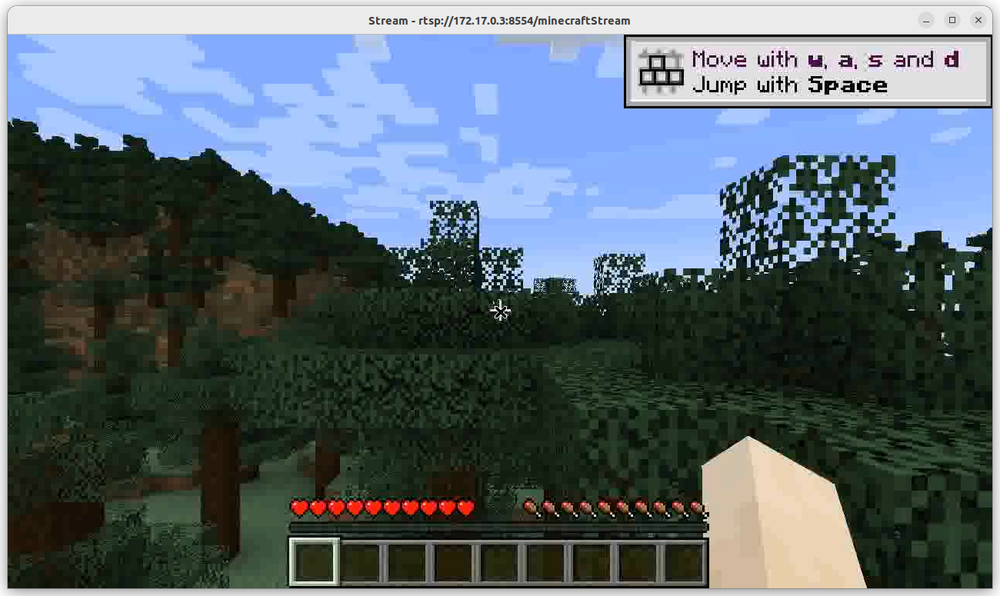
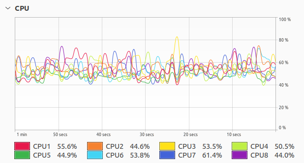

# Dockerized Minecraft RTSP Stream
###### Yes, this really is as dumb as it sounds.

## How to get started
* Build the container using `make`
* Run the container (`docker run --rm furrysalamander/minecraft-rtsp`)
* Find out the container's IP address
    ```bash
    $ docker ps
    CONTAINER ID   IMAGE                            COMMAND                  CREATED          STATUS          PORTS     NAMES
    243427b67ec0   furrysalamander/minecraft-rtsp   "/bin/sh -c /root/en…"   6 minutes ago    Up 6 minutes              dazzling_shannon
    $ docker inspect -f '{{range.NetworkSettings.Networks}}{{.IPAddress}}{{end}}' dazzling_shannon
    ```
* Connect to the container's RTSP stream
    ```bash
    $ ffplay -rtsp_transport tcp rtsp://172.17.0.3:8554/minecraftStream
    ```
* Question your decisions in life that brought you to this moment.

## Screenshot

Somehow this runs at a higher frame rate than on the computer I had in high school.



## FAQ
* Why?
    * Because I can.

## Support Me
Like this project?  Feel free to make a donation.

[](https://ko-fi.com/L3L63ISSH)

